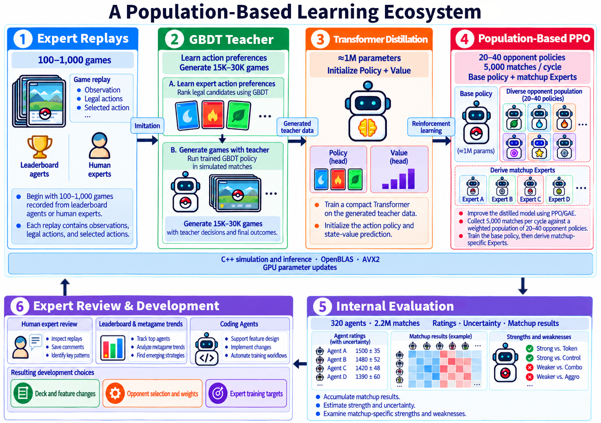
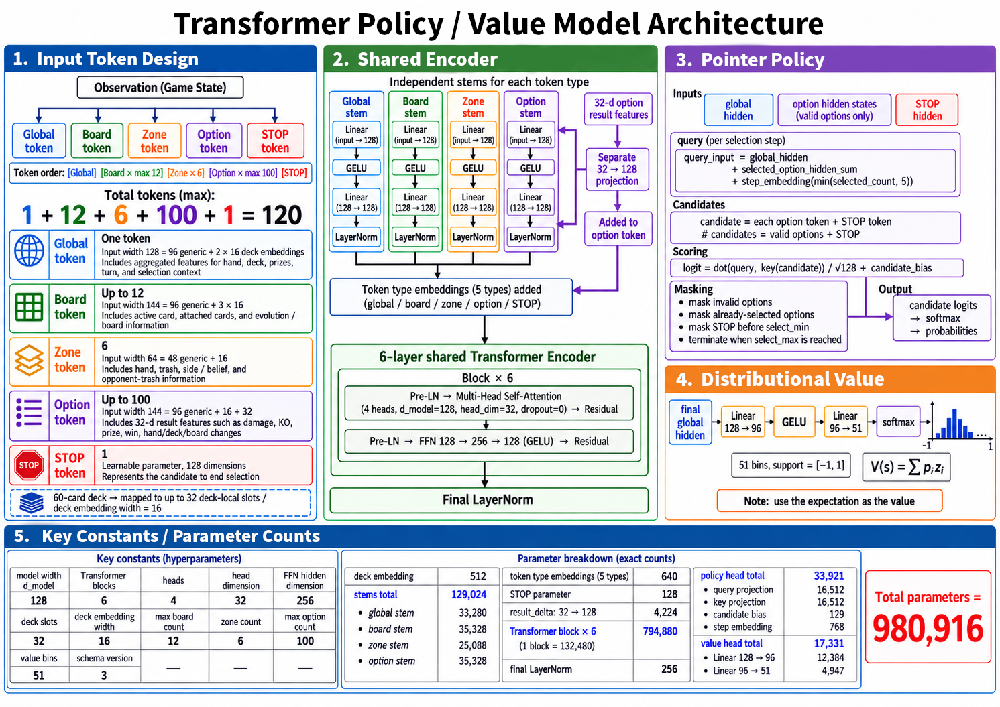

# Pokémon TCG AI Battle — Population-based RL Sample Implementation

[日本語版](README.ja.md)はこちら

A minimal [Pokémon TCG AI Battle](https://www.kaggle.com/competitions/pokemon-tcg-ai-battle) learning pipeline: C++ arena, GBDT imitation, Transformer distillation, and PPO.

This repository implements a sample of [24th Solution: A Population-Based RL Ecosystem](https://www.kaggle.com/competitions/pokemon-tcg-ai-battle/writeups/24th-solution-a-population-based-rl-ecosystem), with support for all four official decks.

## Code layout

```text
src/
├── agents/
│   ├── <agent>/
│   │   ├── main.py, deck.csv    # Official Python policy and bundled deck
│   │   ├── cpp/                # Rule policy, factory, and training records
│   │   ├── scripts/            # Teacher matches and pipeline validation
│   │   ├── gbdt/               # Features and tree training; cpp/ and scripts/
│   │   ├── transformer/        # Tokens and distillation; cpp/ and scripts/
│   │   └── ppo/                # Rollouts, GAE, and updates; cpp/ and scripts/
│   └── cpp/registry.h          # Agent registration
├── engine/cpp/                 # Observations, legal actions, matches, and records
├── engine/cg/                  # Unmodified external engine, excluded from Git
└── tools/                      # Downloads, builds, official parity, and ratings
```

Weights, replays, extracted features, and build artifacts are excluded from Git.

### Supported agents

| Agent | Official deck | GBDT features | Code and official notebook |
|---|---|---:|---|
| `mega_lucario` | Mega Lucario ex | 4,926 | [Code](src/agents/mega_lucario/) · [Notebook](https://www.kaggle.com/code/kiyotah/a-sample-rule-based-agent-mega-lucario-ex-deck) |
| `dragapult` | Dragapult ex | 5,078 | [Code](src/agents/dragapult/) · [Notebook](https://www.kaggle.com/code/kiyotah/a-sample-rule-based-agent-dragapult-ex-deck) |
| `iono` | Iono | 4,882 | [Code](src/agents/iono/) · [Notebook](https://www.kaggle.com/code/kiyotah/a-sample-rule-based-agent-iono-s-deck) |
| `mega_abomasnow` | Mega Abomasnow ex | 4,714 | [Code](src/agents/mega_abomasnow/) · [Notebook](https://www.kaggle.com/code/kiyotah/a-sample-rule-based-agent-mega-abomasnow-ex-deck) |

Each agent has Python/C++ rule policies, GBDT, Transformer, and PPO implementations.
C++ rule policies use the names above. Trained policies use `<name>_gbdt` or `<name>_transformer`; PPO uses the Transformer policy interface.
Training commands live in each method's `scripts/` directory. Run them with `--help` to see their arguments.

## Set up uv

Use Linux x86-64, Python 3.12 or newer, and a C++20-capable `g++`. GBDT runs on CPU; Transformer and PPO updates use CUDA-enabled PyTorch.

If uv is not installed, run the [official installer](https://docs.astral.sh/uv/getting-started/installation/) and reopen your terminal:

```bash
curl -LsSf https://astral.sh/uv/install.sh | sh
```

Run subsequent commands from the repository root. `uv sync` creates `.venv`; manual activation is unnecessary.

```bash
uv sync --locked --dev
uv run kaggle --version
uv run python -c "import torch; print(torch.__version__, torch.version.cuda, torch.cuda.is_available())"
```

The locked Linux PyTorch package includes CUDA support. If CUDA availability is `False`, check access to your GPU and driver.
Use `--device cpu` for CPU training. See the [uv and PyTorch guide](https://docs.astral.sh/uv/guides/integration/pytorch/) for environment details.

The Kaggle CLI is a development dependency. Configure your Kaggle credentials and competition data access, then download the external assets and build the arena:

```bash
uv run python src/tools/fetch_official_assets.py
uv run python src/tools/fetch_cg_engine.py
uv run python src/tools/build_cpp_engine.py
```

Each agent's `deck.csv` is bundled. The competition C++ engine is downloaded into `src/engine/cg/` and included without modification.
C++ inference can use OpenBLAS from the uv environment. See the [engine guide](src/engine/README.md) for download locations and offline verification.

## Solution overview

An agent receives an observation and a list of legal options, then returns the indices it chooses. It must decide how to develop the board, attack, and allocate energy without seeing the opponent's hand or deck order. The competition's C++ engine implements the game rules.



1. **Record rule-policy matches.** Save each observation before selection alongside the action taken.
2. **Imitate actions with GBDT.** Extract board and candidate features, then train LightGBM LambdaRank to rank the teacher's choices. Separate tree banks handle MAIN and other decisions; both are stored in one `.gbdt` file.
3. **Distill into a Transformer.** Play GBDT matches and learn Policy and Value from candidate scores, actions, and terminal results.
4. **Update with PPO.** Collect fresh matches with the current policy, then use the recorded action probabilities, Value estimates, and terminal rewards for GAE and PPO updates.
5. **Evaluate in C++.** Export `.pt` checkpoints to `.bin` for inference without Python. Use fixed opponents, common seeds, and swapped seats to estimate ratings and uncertainty.

The figures show the full approach from the public writeup. This sample omits human/LB-agent replays, matchup experts, automatic population selection, and large-scale operation. Match counts and timings in the figures are not measurements of this repository.



All decks use a Transformer with **128 dimensions, 6 layers, 4 heads, at most 120 tokens, and 980,916 parameters**.
Global, Board, Zone, Option, and STOP tokens pass through an encoder to a pointer policy and a 51-bin value distribution. Deck vocabularies and features vary; the model architecture is shared.
The other three decks encode public card placement, evolution relationships, energy, and attack IDs. They do not reuse Lucario-specific attack-result calculations; unavailable result channels remain unknown.

## Measure ratings

A Bayesian Bradley–Terry model estimates ratings from match results. This example plays two matches for every pair of the four rule policies:

```bash
uv run python src/tools/rating_arena.py \
  --output-dir outputs/rating_example --games-per-pair 2 --workers 2
```

`--games-per-pair` is an **even total across both seat assignments**. Both assignments use the same seeds. Seats 0/1 do not directly select who goes first.
Add `--resume` with the same output directory to reuse completed matches and increase the match count.

`ratings.json` and `ratings.csv` contain estimates, standard deviations, lower bounds, and matchup W/D/L. Ratings are centered on a pool average of 1,000.
**These are internal ratings, separate from official LB ratings**; changing the opponent pool changes the scale.

See the [rating guide](src/tools/README.md) for model rosters, estimation settings, and resuming runs.

## Development

Format Python and check imports, annotations, and docstrings with Ruff:

```bash
uv run ruff format src
uv run ruff check src
```

## License

The code, documentation, and figures are released under the [Apache License 2.0](LICENSE).
